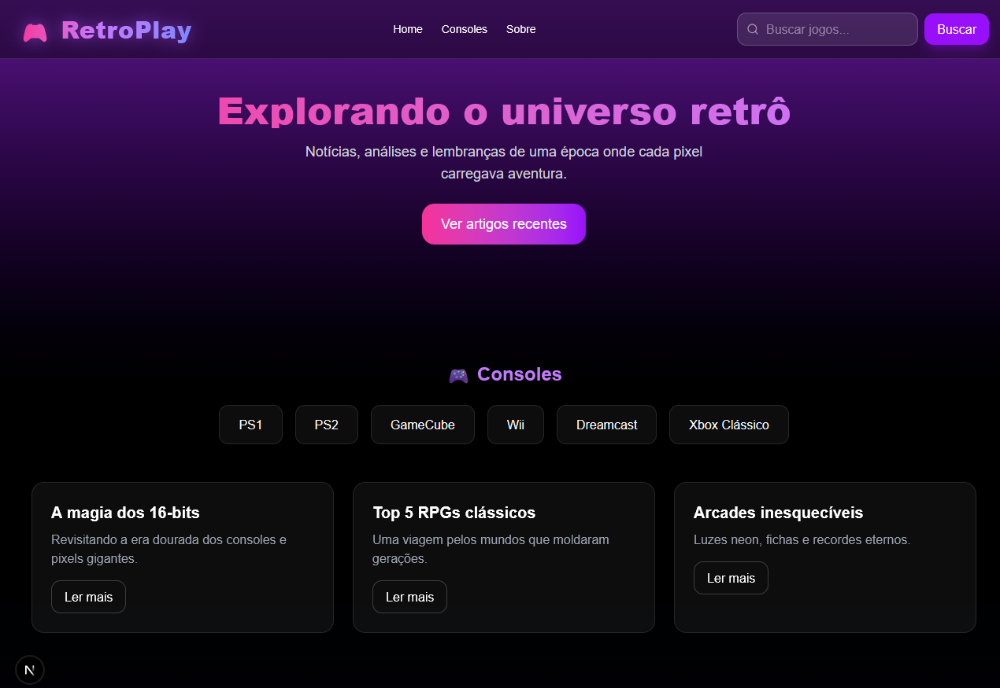

# 🎮 Blog Old Games



## 📌 Sobre o Projeto

O **Blog Old Games** é uma aplicação web desenvolvida com o objetivo de resgatar a nostalgia dos jogos clássicos e consoles que marcaram gerações.  
A plataforma apresenta conteúdos informativos, listas e destaques sobre o universo retrô dos games, com uma interface moderna e responsiva.

Este projeto foi desenvolvido como parte de estudos em desenvolvimento web, aplicando conceitos fundamentais de front-end e boas práticas de estruturação.

---

## 🚀 Funcionalidades

- 🕹️ Exibição de conteúdos sobre jogos clássicos  
- 🔍 Barra de busca para encontrar jogos  
- 📱 Layout responsivo (adaptável para mobile e desktop)  
- 🎨 Interface moderna com estilo retrô  
- 📂 Organização por categorias/consoles (em evolução)

---

## 🛠️ Tecnologias Utilizadas

- **HTML5**
- **CSS3**
- **JavaScript**
- **TailwindCSS**
- **React / Next.js** (se estiver usando)

---

## 🎯 Objetivo

O principal objetivo do projeto é:

- Praticar desenvolvimento web na prática  
- Criar uma interface atrativa e funcional  
- Explorar conceitos de UI/UX  
- Desenvolver um portfólio com identidade própria  

---

## 📸 Preview

Abaixo está uma prévia da aplicação:


---

## ⚙️ Como Executar o Projeto

1. Clone o repositório:
```bash
git clone https://github.com/seu-usuario/blog-old-games.git
````

2. Acesse a pasta do projeto:

```bash
cd blog-old-games
```

3. Instale as dependências:

```bash
npm install
```

4. Execute o projeto:

```bash
npm run dev
```

5. Abra no navegador:

```
http://localhost:3000
```

---

## 📈 Melhorias Futuras

* 🔐 Sistema de login de usuários
* 💬 Área de comentários
* 🎮 Página individual para cada console
* ⭐ Sistema de avaliação de jogos
* 🌙 Modo dark/light alternável

---

## 🤝 Contribuição

Contribuições são bem-vindas!
Sinta-se à vontade para abrir uma *issue* ou enviar um *pull request*.

---

## 📄 Licença

Este projeto está sob a licença MIT.
Sinta-se livre para usar e modificar.

---

## 👨‍💻 Autor

Desenvolvido por **Lucas Neves da Silva**
